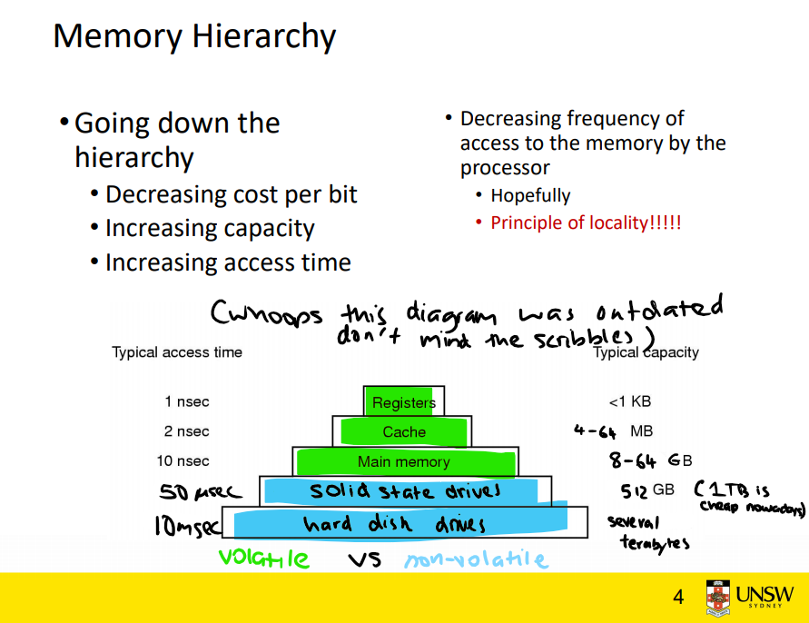

# Virtual memory

**Poll**: How are you feeling about virtual memory?

### Memory hierarchy


### Cool things virtual memory lets us do
- swapping to a 'backing store'
    - we can have a 'swapfile' (or 'pagefile' on Windows)
    - stored on a solid state drive or hard disk drive
    - if we swap things out of memory that we aren't currently using, we can run more processes (such as Chrome tabs)
- not need contiguous free memory
- process/kernel isolation
    - **kernel** is the privileged part of the operating system
        - kernel memory can't be modified by other programs
    - allows for processes to exist independently of others
        - prevents modification of one program's memory by another program
- shared object libraries
    - the C library, `libc`
        - can load libc only once, and share it between different processes


#### Non-contiguous allocation?

Here's some physical memory. What if I want to load another process requiring three 'blocks' of memory?
```
   +------+------+------+------+------+------+
   | TAB  | TAB  | USED | USED | USED | TAB  |
   +------+------+------+------+------+------+
```
- could shift our used blocks in order to have 3 free blocks
    - computationally expensive for our CPU to copy memory over
- we use virtual memory!

### Some things to consider
- addressing in machine code (such as MIPS) operates on actual addresses
    - we have to do this, since we don't know where in physical memory our program will get loaded
- we use virtual addressing
    - we have hardware to translate a process' view of virtual memory to actual memory

### When might we not need virtual memory?
- embedded systems
    - example: microcontroller on a washing machine probably just has a single process

### Pages and frames
- **Pages** are fixed size region of virtual memory.
    - Each page is typically about 4096 bytes.
- **Frames** are fixed size regions of **physical memory**.
    - Virtual pages map to a corresponding physical frame.
    - The size of a physical frame has to be the same as the size of a page.
- **Segments** are when a virtual memory system uses non-fixed size regions.
- Page/frame sizes are often a power of 2 - this allows us to perform bitwise operations to speed things up.

#### Page tables
**Page tables** are a per-process mapping of virtual pages to physical frames.

**Inverted page tables** are an operating system construct which map physical frames to virtual pages. This will be important for this week's lab!

### What is the difference between a virtual address and physical address?
A virtual address refers to an address in a program's view of memory.
A physical address refers to an address on actual RAM.

### What tends to happen when we access a virtual address which isn't in our address space?
    - We get segmentation faults whenever we try to access memory outside our address space.
    - The address 0 is typically not part of an address space because it often represent NULL pointers, 
      and we want errors when we attempt to access a NULL pointer.

### Let's say that hypothetically page/frame sizes were 4096 bytes each - how would we map virtual address to physical addresses?

take this virtual address: 0x5736cf8e
we can split virtual addresses into a page number and an offset
page number: 5736c
offset: f8e

PAGE TABLE:
virtual page 5736c actually maps to physical frame 01337

virtual address 0x5736cf8e corresponds to physical address 0x01337f8e

This translation of virtual addresses to physical addresses is often done by dedicated hardware.

### Each new process in a computer system will have its own address space. Which parts of the address space contain initial values at the point when the process starts running? Which parts of the address space can be modified as the process executes?
- Code/Text
    - is loaded in when the address space for the process is created
    - we need to be able to read our code
    - we don't want self-modifying programs, so we cannot write to our code segment
    - our code needs to be executable
- Data
    - rodata
        - can read
        - can't write
        - can't execute
    - Global variables
        - can read
        - can write
        - can't execute
    - Dynamic data (heap)
        - can read
        - can write
        - can't execute
- Stack
    - can read
    - can write
    - can't execute

### Assume we have 6 virtual memory pages and 4 physical memory pages and are using a least-recently-used (LRU) replacement strategy.

See `lru_example.md`.

### Let's take a look at the starter code for this week's lab!
See `lru.c`.

```
$ dcc lru.c -o lru
$ ./lru
Simulating 4 pages of physical memory, 6 pages of virtual memory
5
Time 0: virtual page 5 loaded to physical page 0
3
Time 1: virtual page 3 loaded to physical page 1
5
Time 2: virtual page 5 -> physical page 0
3
Time 3: virtual page 3 -> physical page 1
0
Time 4: virtual page 0 loaded to physical page 2
1
Time 5: virtual page 1 loaded to physical page 3
2
Time 6: virtual page 2  - virtual page 5 evicted - loaded to physical page 0
2
Time 7: virtual page 2 -> physical page 0
3
Time 8: virtual page 3 -> physical page 1
5
Time 9: virtual page 5  - virtual page 0 evicted - loaded to physical page 2
```

### One possible (and quite old) approach to loading programs into memory is to load the entire program address space into a single contiguous chunk of RAM, but not necessarily at location 0.
See `contiguous.md`.

### Consider a process whose address space is partitioned into 4KB pages and the pages are distributed across physical memory.
See `paged_proc.md`.

### Working sets and page faults
See `working_set.md`.
