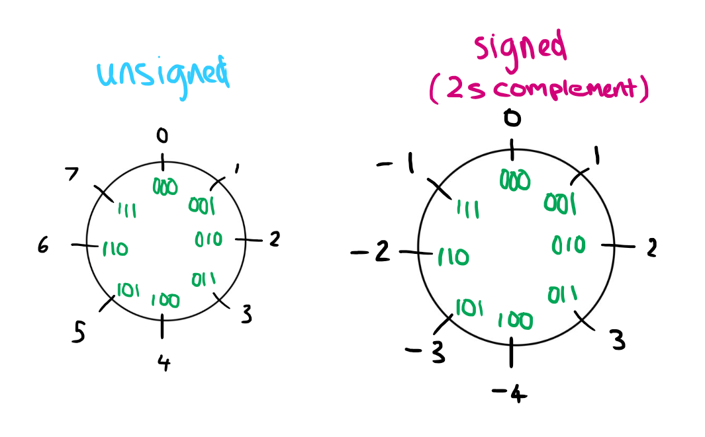
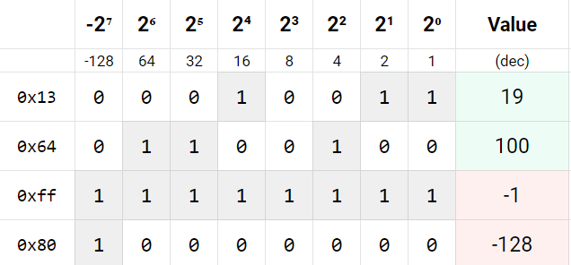

# Twos complement representation

We'll get started shortly!
(This week shouldn't be nearly as long as last week.)

## A hypothetical 3-bit twos complement system
(You'll never find a computer using a 3-bit system in real life, but it for a nice example.)



## Converting from 8-bit twos complement to decimal

(We'll need to convert the values into binary to get the bitstring)

```c
-  0x13
b: 0001 0011

-  0x64
b: 0110 0100

-  0xff
b: 1111 1111

-  0x80
b: 1000 0000
```

[Le spreadsheet](https://docs.google.com/spreadsheets/d/1Sf8U_3197HNtd-399DcJiLHrb7N_ZJn5X0rWq5uHl8M/edit)



## Converting from decimal values to 8-bit two's complement

```c
- 1
If positive, it is just the usual binary.
0000 0001

- 127
If positive, it is just the usual binary.
0111 1111

- -128
If negative, we write the positive value as binary.
1000 0000

Then, we flip the bits of the number.
0111 1111

To finish, we add one to the number to get our solution.
1000 0000

- -1
If negative, we write the positive value as binary.
0000 0001

Then, we flip the bits of the number.
1111 1110

To finish, we add one to the binary to get our solution.
1111 1111
```

# IEEE 754 floating point numbers


(The mantissa may also be called the fraction, but I prefer mantissa since it sounds cooler.)

## Special cases (important for today's lab)

```go
- zero:
    - has an exponent of 0:
        00000000
    - has a mantissa of 0:
        00000000000000000000000
    - could be positive zero (sign=0) or negative zero (sign=1)

- nan (not a number)
    - used to indicate a value we cant represent
        - 0/0, sqrt of negative numbers
    - sign could be 0 or 1
    - has an exponent with all bits set to 1:
        11111111
    - mantissa can be anything EXCEPT 0
        (eg. 01001000000100000110000)

- infinity
    - has an exponent with all bits set to 1, just like nan:
        11111111
    - the difference is that mantissa must be 0:
        00000000000000000000000
    - could be positive infinity (sign=0) or negative infinity (sign=1)
```

# Unions
See `my_first_union.c`.

## How many bytes does each union take?
can assume `sizeof(char) == 1`, `sizeof(short) == 2`, `sizeof(int) == 4`

- ```c
    union { 
        int a;
        int b;
    } u1;
  ```
    // sizeof a union is the size of its largest possible member
    // size is 4 since integers are 4 bytes
    (this union is pointless)
- ```c
    union { 
        unsigned short a;
        char b; 
    } 
    u2;
  ```
  // union needs two bytes
  // (in reality, it'll take up 4 bytes - padding)

- ```c
    union {
        int a; // 4 bytes
        char b[12]; // 12 bytes
} 
    u3;
  ```
  // 12 bytes - largest member is 12 bytes

- ```c
    union {
        int a; // 4 bytes
        char b[14]; // 14 bytes
    } u2;
  ```
  // union needs 14 bytes
  // (in reality, tends to take up 16 bytes)


# Struct and mask revision (useful for this week's lab)

Write a C function, `get_bit_groups`, which, given a `uint32_t`, extracts and returns the middle six bits and the bottom six bits in a struct.

For example:
```c
00000000 00000101 01000000 01110110

middle six bits are 101010
 lower six bits are 110110  
```

# Lab notes

- You can absolutely use your functions from the first exercise to complete the other exercises - just copy and paste your functions into each file you use them in.
- Remember, to use a struct, you need to create a new instance of a struct and return it, just like the `six_bit_groups.c` exercise.
